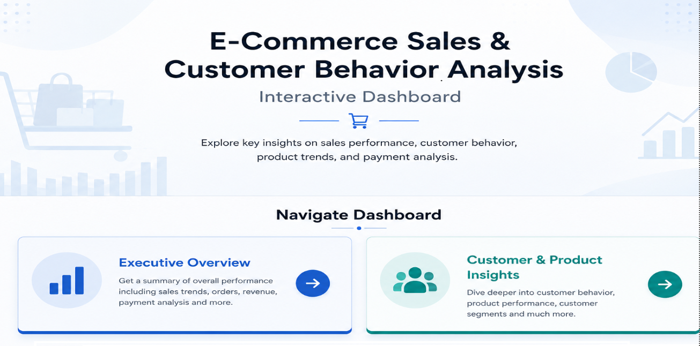
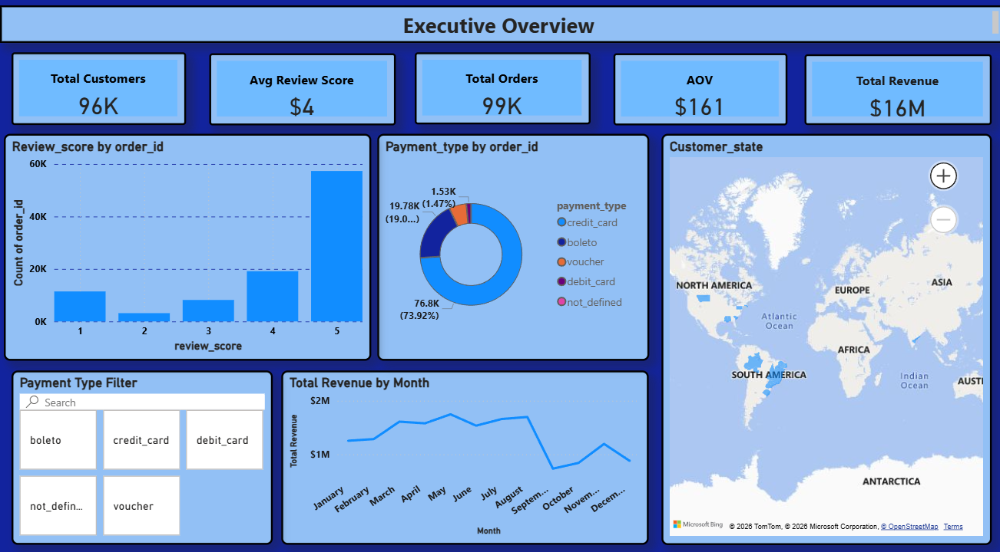
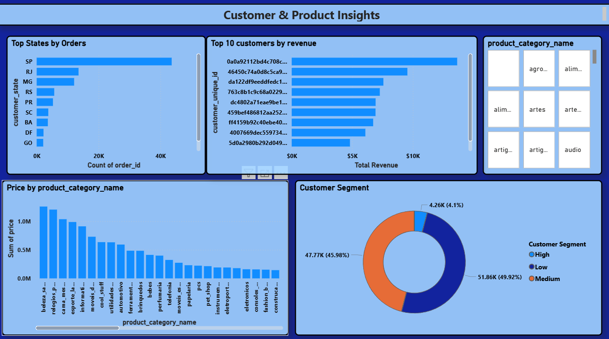

# Power BI Dashboard Documentation
# E-Commerce Sales & Customer Behavior Analysis

## Dashboard Overview
This Power BI dashboard analyzes e-commerce sales and customer behavior using interactive visualizations and KPI analysis.

The dashboard provides insights into:
- Revenue trends
- Customer behavior
- Product performance
- Payment analysis
- Review analysis
- Regional sales distribution

---

# Dashboard Pages

| Page Name | Purpose |
|------------|----------|
| Home Page | Navigation & Introduction |
| Executive Overview | Sales & KPI Analysis |
| Customer & Product Insights | Customer & Product Analysis |

---

# 1. Home Page

## Purpose
The Home Page acts as a landing page for dashboard navigation.

## Features
- Dashboard Title
- Navigation Buttons
- Simple UI Design

---

# 2. Executive Overview

## Purpose
Provides a high-level summary of business performance.

---

# KPI Cards

- Total Revenue
- Total Orders
- Total Customers
- Average Order Value (AOV)
- Average Review Score

---

# Visualizations Used

## Monthly Revenue Trend
- Shows monthly sales performance
- Identifies sales growth trends

## Payment Type Analysis
- Displays most used payment methods
- Credit Card was most preferred

## Review Score Distribution
- Shows customer satisfaction patterns

## State-wise Customer Distribution
- Displays regional order distribution

## Payment Type Filter
- Allows interactive filtering

---

# 3. Customer & Product Insights

## Purpose
Analyzes customer behavior and product performance.

---

# Visualizations Used

## Top Customers by Revenue
- Identifies high-value customers

## Product Category Analysis
- Shows top-performing categories
- Beauty & Health generated highest revenue

## Customer Segmentation
Customers categorized into:
- Low Spenders
- Medium Spenders
- High Spenders

## Product Category Filter
- Enables category-based analysis

---

# Data Modeling

## Relationships Created

| Table 1 | Table 2 | Relationship |
|----------|----------|--------------|
| Customers | Orders | customer_id |
| Orders | Payments | order_id |
| Orders | Order Items | order_id |
| Products | Order Items | product_id |
| Orders | Reviews | order_id |

---

# Key Business Insights

- Beauty & Health products generated highest revenue.
- Credit Card was the most used payment method.
- Most customer reviews were positive.
- Monthly sales fluctuated across different months.
- Some states generated higher sales and orders.

---

# Conclusion

This dashboard converts raw e-commerce data into meaningful business insights using SQL and Power BI.

The project helped strengthen skills in:
- SQL
- Power BI
- Dashboard Design
- Data Analytics
- Business Intelligence

---

# Author

## Mamta Rathore
Aspiring Data Analyst | SQL | Power BI | Data Analytics
